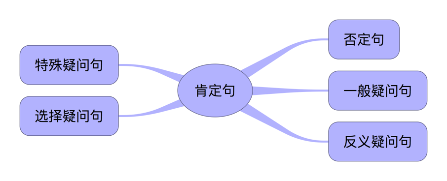
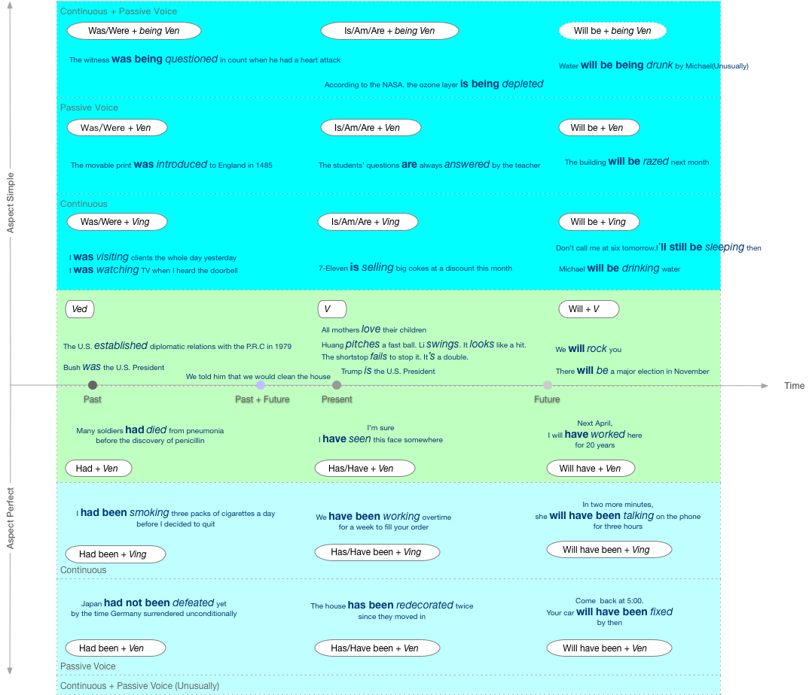
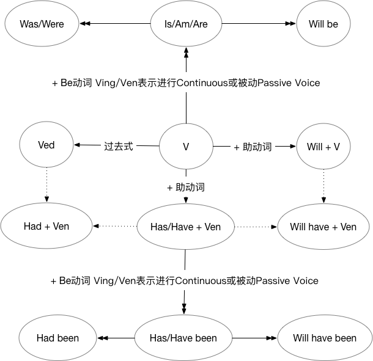

# Table of Contents
1. [Overview](#I. Overview)
2. [基本句型和补语](#II. 基本句型和补语)
3. [句型转换](#III. 句型转换)
4. [动词的"时(time)"和"态"(aspect)](#IV. 动词的time和态aspect)

## I. Overview

## II. 基本句型和补语
#### A. 五种不同的句型对应五种基本句型

##### a. S+V(_不及物 intransitive verb_)
1. John Smith died in World War Two.

##### b. S+V(_及物 transitive verb_)+O
1. John Smith killed three enemy soldiers.

##### c. S+V(_及物 transitive verb_)+O+O
1. John‘s father gave him a dog.

##### d. S+V(_连缀动词 Linking Verb_)+C
1. The soup is too hot.
2. John Smith was a soldier.
3. John Smith was courageous.
4. I feel sick.

##### e. S+V(_连缀动词 Linking Verb_)+O+C
1. The food made me sick.
2. Most people consider a nurse a good wife.
3. I find the dress pretty.
4. The meat made the dog friendly.
5. John's father called him a dog.
6. His college training made him a teacher.
7. I don't find the drug bitter.
8. I consider the story false.
9. He found the trip exciting.

#### B. Complement
##### a. 英语中Be动词在句子中不能省略, 但翻译成中文，如果补语是形容词，“是”会被丢弃
  1. Taroko Gorge is beautiful. Taroko Gorge ~~is(是)~~ 美丽的
  2. The soup is too hot. 汤 ~~is(是)~~ 太烫了

##### b. 除了Be, 还有哪些**Linking Verb**

| 是 | Example | 为(是的文言文) | Example |
| -- | -- | --| -- |
| look | That dress looks pretty. | turn(转变为) ||
| seem(似乎是) | The dog seems friendly. | prove(证实为) | The story proved false. |
| appear(显得是) | His demands appear reasonable. | become(成为) | He became a teacher. |
| sound | His trip sounds exciting. | make(作为) | A nurse make a good wife. |
| feel | I feel sick. |||
| taste | The drug tastes bitter. |||

##### c. 这类动词**Linking Verb**本身没有叙述能力, 需要用Complement补足句子, 补语有两种词类
  1. 名词(noun) - 表达与主语的同等关系
  2. 形容词(adjective)

##### d. Be不作为**Linking Verb**, 不解释为"是, 而是要解释为"存在", 用在S+V句型中
  1. I think, therefore I am. (René Descartes, 笛卡儿)
  2. To be or not to be, that is the question. (@Hamlet, 哈姆雷特)

## III. 句型转换

#### A. 肯定句 → 否定句
##### a. Be+Not
1. I **am** a girl. → I **am not** a girl.
2. You **are** a student. → You **are not** a student. → You **aren’t** a student.
3. This **is** Tom’s bag. → This **is not** Tom’s bag. → This **isn’t** Tom’s bag.

##### b. 及物动词(transitive verb)/不及物动词(intransitive verb), 在动词前加助动词的否定形式, don't/doesn't/didn't
1. They really **know** what will happen. → They really **don't know** what will happen.
2. Someone **know** what he/she is missing. → Someone **doesn't know** what he/she is missing.
3. I **want** to write this. → I **didn't want** to write this, but the courage to listen to different ideas is vanishing

##### c. 助动词+Not, can not/should not/will not
1. Trump **can keep** his corruption hidden forever. → Trump **cannot keep** his corruption hidden forever.
2. You **should do** that. → You **should not do** that.
3. Turkey **will back down** due to US sanctions. → Turkey **will not back down** due to US sanctions. → Turkey won't back down due to US sanctions.

##### d. some → any
1. I got **some** nice presents for Christmas this year. → I didn't get **any** nice presents for Christmas this year.
2. I'd like to go **somewhere** hot this summer. → I'm not hungry. I don't want **anything** to eat.

#### B. 肯定句 → 一般疑问句
##### a. Be动词放在句首
1. **I am** in Class 6. → **Are you** in Class 6?
2. **There are** some apples. → **Are there** any apples?

##### b. 及物动词(transitive verb)/不及物动词(intransitive verb), 加Do/Does/Did放在句首
1. **I like** red. → **Do you** like red?
2. **He wants** to play soccer with friends. → **Does he** want to play soccer with friends?
3. **We finished** our homework before nine yesterday. → **Did you** finish your homework before nine yesterday?

##### c. 助动词can/shall/will等放在句首
1. **I will** go to hospital tomorrow. → **Will you** go to hospital tomorrow?
2. **He can** climb the tree. → **Can he** climb the tree?

##### d. some → any
1. We can use **some** in questions when offering/requesting:
  * Would you like **some** more tea?
  * Could I have **some** milk, please?
  * Do you want **something** to eat?

2. We use **any** in positive sentences when we mean it doesn't matter which ..:
  * You can come and ask for my help **any** time.
  * Which book shall I read? - **Any** one. It's up to you.
  * You can sit **anywhere** but here. This is my seat!

#### C. 肯定句 → 特殊疑问句
##### a. 划出提问部分(对划线（斜体或黑体）部分提问)

##### b. 用疑问词替代划线部分, 并移到句首

##### c. 加助动词, 并颠倒主谓
1. Mike is ~~a worker~~. → **What** _is Mike_?
2. He is ~~my brother~. → **Who** _is he_?
3. The box is ~~on the desk~~.→ **Where** _is the box_?
4. It's ~~seven twenty~~. → **What time** _is it_?
5. I usually get up ~~at six~~. → **When** _do you_ usually get up?
6. I am ~~twelve~~. → **How old** _are you_?
7. My hat is ~~blu~~. → **What color** _is your hat_？
8. I can see ~~five kites~~.→ **How many kites** _can you_ see?
9. There is ~~some milk~~ in the glass. → **How much milk** _is there_ in the glass?
10. This pen is ~~nine yuan~~. → **How much** _is this pen_?
11. That is ~~my book~~. → **Whose book** _is that_?
12. The bag is ~~yours~~. → **Whose** _is the bag_?

##### d. 如果疑问词作主语(Subject)或主语的定语, 语序保持陈述句的语序
1. He is ~~my brother~~. → **Who** _is he_?
2. ~~He~~ is my brother. → **Who** is my brother?

## IV. 动词的"时(time)"和"态(aspect)"

#### A. 以简驭繁的方式:
* **Time(Past/Present/Future)**和**Aspect**分开处理
* 当需要表达进行或被动语态时, 把Be动词当作动词, 句子**只有两种Aspect状态(简单态与完成态)**, 其后的现代分词(Ving)和过去分词(Ven)视为**形容词补语**, Ving表示Continuous, Ven表示Passive Voice
* 根据Time和Aspect变换Be动词

#### B. 简单式
##### a. 过去时间
1. Ved
  * The U.S. **established** diplomatic relations with the P.R.C in 1979.
  * Bush **was** the U.S. President.
2. Was/Were + Ving
  * I **was** _visiting_ clients the whole day yesterday.
  * I **was** _watching_ TV when I heard the doorbell.
3. Was/Were + Ven
  * The movable print **was** _introduced_ to England in 1485.
4. Was/Were + being Ven
  * The witness **was** _being questioned_ in count when he had a heart attack.
  * The house **was** _being painted_ when we arrived.

##### b. 现在时间
1. V
  * All mothers **love** their children.
  * Huang **pitches** a fast ball. Li **swings**. It **looks** like a hit.
The shortstop **fails** to stop it. It**’s** a double.
  * Trump **is** the U.S. President.
2. Is/Am/Are + Ving
  * 7-Eleven **is** _selling_ big cokes at a discount this month.
3. Is/Am/Are + Ven
  * The students’ questions **are** always _answered_ by the teacher.
4. Is/Am/Are + being + Ven
  * According to the NASA, the ozone layer **is** _being depleted_.
  * How **is** the new teaching method _being tried_ there.

##### c. 未来时间
1. Will + V
  * We **will** _rock_ you.
  * There **will** _be_ a major election in November.
2. Will be + Ving.
  * Don’t call me at six tomorrow. I**’ll still be** _sleeping_ then.
  * Michael **will be** _drinking_ water.
3. Will be + Ven
  * The building **will be** _razed_ next month.
4. ~~Will be + being Ven~~(Unusually)
  * ~~Water **will be** _being drunk_ by Michael.~~

##### d. 过去将来时
1. We told him that we **would** _clean_ the house.

#### C. 完成式
##### a. 过去时间
1. Had + Ven
  * Many soldiers **had** _died_ from pneumonia before the discovery of penicillin.
2. Had been + Ving
  * I **had been** _smoking_ three packs of cigarettes a day before I decided to quit.
3. Had been + Ven
  * Japan **had not been** _defeated_ yet by the time Germany surrendered unconditionally.

##### b. 现在时间
1. Has/Have + Ven
  * I’m sure I **have** _seen_ this face somewhere.
2. Has/Have been + Ving
  * We **have been** _working_ overtime for a week to fill your order.
3. Has/Have been + Ven
  * The house **has been** _redecorated_ twice since they moved in.

##### c. 未来时间
1. Will have + Ven
  * Next April, I **will have** _worked_ here for 20 years.
2. Will have been + Ving
  * In two more minutes, she **will have been** _talking_ on the phone for three hours.
3. Will have been + Ven
  * Come back at 5:00. Your car **will have been** _fixed_ by then.

## V. 动状词(Verbals)
| Type | Pattern | Part of Speech | Role in Sentence | Example |
| --- | --- | --- | --- |
| 现在分词 | Ving | 形容词 Adjective | Complement ||
| 过去分词 | Ven | 形容词 Adjective | Complement ||
| 动名词(Gerund) | Ving | 名词 Noun | Subject/Object/Complement ||
| 不定式短语 Infinitive | to do | 名词 Noun |Subject/Object/Complement||
||| 形容词 Adjective | Subject/Object/Complement ||
||| 副词 Adverbial | 修饰动词或形容词 ||

#### A. 不定式短语 Infinitive
##### a. 从助动词(Auxiliaries)演变到不定式短语(Infinitive)
1. I am glad because I **can** know you. S+V+C(Clause)
2. I am glad because I **am able to** know you. 助动词 → be able to
3. I am glad ~~because I am able~~ to know you. Conjunction, Subject and Be动词省略

|Auxiliaries|Infinitive|
|-|-|
|must|have to|
|should|ought to|
|will/would|be going to|
|can/could|be able to|
|may/might|be likely to|

##### b. 都有不确定的语气
1. He is right. 他是对的
2. He **may be** right. 他可能式对的
3. He seems **to be** right. 他好像是对的

##### c. 都是用完成式来表达相对过去的时间
1. 现在进行中
  * It **must be** _raining_ now. 现在一定下雨了
2. 未来的推测
  * It **may** _rain_ any minutes.
  * It **might** even _snow_。
3. 对过去的推测
  * It **must** _have rained_ last night. 昨晚一定下过雨了
  * It **seems to** _have rained_ last night. 昨晚好像下过雨

##### c. Infinitive VS Gerund
1. plan
  * They plan that they **will** marry next month.
  * They plan ~~that they **are**~~ to marry next month.
  * They **plan to marry** next month.
2. avoid
  * I **avoid making** the same mistake twice.
3. hate
  * I hate I **must** say, but I think you're mistaken.
  * I hate ~~I **have**~~ to say, but I think you're mistaken.
  * I **hate to** say this, but I think you're mistaken.
4. like/dislike
  * I **like to be** the first.
  * I **don't like to wait** too long.
  * I **dislike standing** in long lines. dislike没有"必须"(have to)的暗示
5. try
  * I always **try to be** on time.
  * Why don't you **try being** late for a change? 你何不故意迟到一次呢？
6. remember
  * Please **remember to give** me a wake-up call at 6:00 tomorrow.
  * I **remember calling** her at 6:00 last night.
7. shop
  * The speaker **stopped talking** at the second bell.
  * The speaker **stopped a second to drink** some water.

8. Verbs Followed by Gerunds [www.englishpage.com](https://www.englishpage.com/gerunds/index.htm)
  * 9 = verb followed by a gerund OR a noun + an infinitive
  * 13 = verb followed by a gerund OR an infinitive with a difference in meaning
  * 14 = verb followed by a gerund OR an infinitive with little difference in meaning

|verb|example|
|-|-|
|admit	|He admitted cheating on the test.|
|advise [9]	|The doctor generally advised drinking low-fat milk.|
|allow [9]	|Ireland doesn't allow smoking in bars.|
|anticipate	|I anticipated arriving late.|
|appreciate	|I appreciated her helping me.|
|avoid	|He avoided talking to her.|
|begin [14]	|I began learning Chinese.|
|can't bear [14]	|He can't bear having so much responsibility.|
|can't help	|He can't help talking so loudly.|
|can't see	|I can't see paying so much money for a car.|
|can't stand [14]	|He can't stand her smoking in the office.|
|cease [14]	|The government ceased providing free healthcare.|
|complete	|He completed renovating the house.|
|consider	|She considered moving to New York.|
|continue [14]	|He continued talking.|
|defend	|The lawyer defended her making such statements.|
|delay	|He delayed doing his taxes.|
|deny	|He denied committing the crime.|
|despise	|She despises waking up early.|
|discuss	|We discussed working at the company.|
|dislike	|She dislikes working after 5 PM.|
|don't mind	|I don't mind helping you.|
|dread [13]	|She dreads getting up at 5 AM.|
|encourage [9]	|He encourages eating healthy foods.|
|enjoy	|We enjoy hiking.|
|finish [13]	|He finished doing his homework.|
|forget [13]	|I forgot giving you my book.|
|hate [14]	|I hate cleaning the bathroom.|
|imagine	|He imagines working there one day.|
|involve	|The job involves traveling to Japan once a month.|
|keep	|She kept interrupting me.|
|like [14]	|She likes listening to music.|
|love [14]	|I love swimming.|
|mention	|He mentioned going to that college.|
|mind	|Do you mind waiting here for a few minutes.|
|miss	|She misses living near the beach.|
|need [13]	|The aquarium needs cleaning.|
|neglect [14]	|Sometimes she neglects doing her homework.|
|permit [9]	|California does not permit smoking in restaurants.|
|postpone	|He postponed returning to Paris.|
|practice	|She practiced singing the song.|
|prefer [14]	|He prefers sitting at the back of the movie theater.|
|propose [14]	|I proposed having lunch at the beach.|
|quit [13]	|She quit worrying about the problem.|
|recall	|Tom recalled using his credit card at the store.|
|recollect	|She recollected living in Kenya.|
|recommend	|Tony recommended taking the train.|
|regret [13]	|She regretted saying that.|
|remember [13]	|I remember telling her the address yesterday.|
|report	|He reported her stealing the money.|
|require [9]	|The certificate requires completing two courses.|
|resent	|Nick resented Debbie's being there.|
|resist	|He resisted asking for help.|
|risk	|He risked being caught.|
|start [14]	|He started studying harder.|
|stop [13]	|She stopped working at 5 o'clock.|
|suggest	|They suggested staying at the hotel.|
|tolerate	|I tolerated her talking.|
|try [13]	|Sam tried opening the lock with a paperclip.|
|understand	|I understand his quitting.|
|urge [9]	|They urge recycling bottles and paper.|

9. Verbs Followed by Infinitives [www.englishpage.com](https://www.englishpage.com/gerunds/index.htm)
  * 8 = verb followed by an infinitive OR an optional noun + an infinitive
  * 13 = verb followed by a gerund OR an infinitive with a difference in meaning
  * 14 = verb followed by a gerund OR an infinitive with little difference in meaning

|verb|example|
|-|----|
|agree|	Tom agreed to help me.|
|appear|	His health appeared to be better.|
|arrange|	Naomi arranged to stay with her cousin in Miami.|
|ask [8]|	She asked to leave.|
|begin [13]|	He began to talk.|
|can't bear [14]|	He can't bear to be alone.|
|can't stand [14]| Nancy can't stand to work the late shift.|
|care|	He doesn't care to participate in the activity.|
|cease [14]|	The government ceased to provide free healthcare.|
|choose [8]|	I chose to help.|
|claim|	She claimed to be a princess.|
|continue [14]|	She continued to talk.|
|decide|	We decided to go to Hawaii.|
|demand|	He demanded to speak to Mr. Harris.|
|deserve|	He deserves to go to jail.|
|dread [13]|	I dread to think what might happen.|
|expect [8]|	They expect to arrive early.|
|fail|	He failed to get enough money to pay for the new project.|
|forget [13]|	I forgot to lock the door when I left.|
|get (be allowed to)|	Debbie gets to go to the concert next week! Why can't I?|
|happen|	She happened to be at the bank when it was robbed.|
|hate [14]|	He hates to clean dishes.|
|hesitate|	She hesitated to tell me the problem.|
|hope|	I hope to begin college this year.|
|intend|	We intend to visit you next spring.|
|learn|	I learned to speak Japanese when I was a kid.|
|like [14]|	Samantha likes to read.|
|love [14]|	We love to scuba dive.|
|manage|	He managed to open the door without the key.|
|need [8,13]|	I need to study.|
|neglect [14]|	She neglected to tell me the date of the meeting.|
|offer|	Frank offered to drive us to the supermarket.|
|plan|	We plan to go to Europe this summer.|
|prefer [14]|	He prefers to eat at 7 PM.|
|prepare [8]|	They prepared to take the test.|
|pretend|	The child pretended to be a monster.|
|promise [8]|	She promised to stop smoking.|
|propose [14]|	Drew proposed to pay for the trip.|
|refuse|	The guard refused to let them enter the building.|
|regret [13]|	I regret to inform you that your application was rejected.|
|remember [13]|	Did you remember to lock the door when you left?|
|seem|	Nancy seemed to be disappointed.|
|start [13]|	Marge started to talk really fast.|
|swear|	She swore to tell the truth.|
|tend	|He tends to be a little shy.|
|threaten [8]|	He threatened to leave forever.|
|try [13]|	Mary tried to lift the table, but it was too heavy.|
|vow|	He vowed to get revenge.|
|wait|	She waited to buy a movie ticket.|
|want [8]|	I want to study Spanish.|
|wish [8]|	I wish to stay.|
|would like [8]|(meaning "wish" or "want")	We would like to start now.|
|yearn|	Melanie yearns to travel somewhere exotic.|
