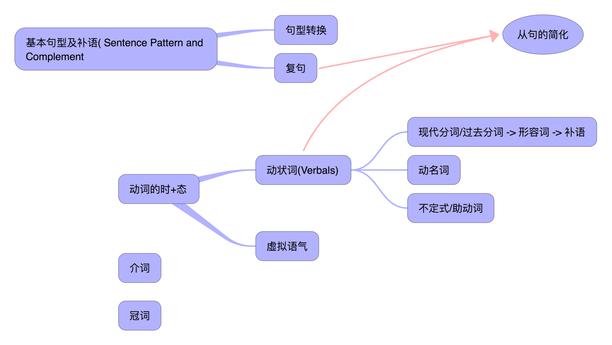
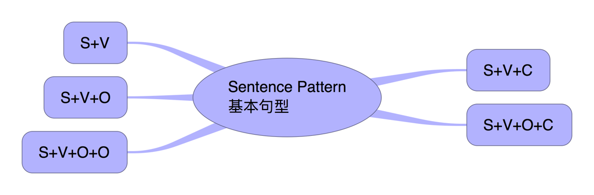

## I. Overview

## II. 基本句型和补语
#### A. 五种不同的句型对应五种基本句型

##### a. S+V(_不及物 intransitive verb_)
1. John Smith died in World War Two.

##### b. S+V(_及物 transitive verb_)+O
1. John Smith killed three enemy soldiers.

##### c. S+V(_及物 transitive verb_)+O+O
1. John‘s father gave him a dog.

##### d. S+V(_连缀动词 Linking Verb_)+C
1. The soup is too hot.
2. John Smith was a soldier.
3. John Smith was courageous.
4. I feel sick.

##### e. S+V(_连缀动词 Linking Verb_)+O+C
1. The food made me sick.
2. Most people consider a nurse a good wife.
3. I find the dress pretty.
4. The meat made the dog friendly.
5. John's father called him a dog.
6. His college training made him a teacher.
7. I don't find the drug bitter.
8. I consider the story false.
9. He found the trip exciting.

#### B. Complement
##### a. 英语中Be动词在句子中不能省略, 但翻译成中文，如果补语是形容词，“是”会被丢弃
  1. Taroko Gorge is beautiful. Taroko Gorge ~~is(是)~~ 美丽的
  2. The soup is too hot. 汤 ~~is(是)~~ 太烫了

##### b. 除了Be, 还有哪些**Linking Verb**

| 是 | Example | 为(是的文言文) | Example |
| -- | -- | --| -- |
| look | That dress looks pretty. | turn(转变为) ||
| seem(似乎是) | The dog seems friendly. | prove(证实为) | The story proved false. |
| appear(显得是) | His demands appear reasonable. | become(成为) | He became a teacher. |
| sound | His trip sounds exciting. | make(作为) | A nurse make a good wife. |
| feel | I feel sick. |||
| taste | The drug tastes bitter. |||

##### c. 这类动词**Linking Verb**本身没有叙述能力, 需要用Complement补足句子, 补语有两种词类
  1. 名词(noun) - 表达与主语的同等关系
  2. 形容词(adjective)

##### d. Be不作为**Linking Verb**, 不解释为"是, 而是要解释为"存在", 用在S+V句型中
  1. I think, therefore I am. (René Descartes, 笛卡儿)
  2. To be or not to be, that is the question. (@Hamlet, 哈姆雷特)

## III. 句型转换

#### A. 肯定句 → 否定句
##### a. Be+Not
1. I **am** a girl. → I **am not** a girl.
2. You **are** a student. → You **are not** a student. → You **aren’t** a student.
3. This **is** Tom’s bag. → This **is not** Tom’s bag. → This **isn’t** Tom’s bag.

##### b. 及物动词(transitive verb)/不及物动词(intransitive verb), 在动词前加助动词的否定形式, don't/doesn't/didn't
1. They really **know** what will happen. → They really **don't know** what will happen.
2. Someone **know** what he/she is missing. → Someone **doesn't know** what he/she is missing.
3. I **want** to write this. → I **didn't want** to write this, but the courage to listen to different ideas is vanishing

##### c. 助动词+Not, can not/should not/will not
1. Trump **can keep** his corruption hidden forever. → Trump **cannot keep** his corruption hidden forever.
2. You **should do** that. → You **should not do** that.
3. Turkey **will back down** due to US sanctions. → Turkey **will not back down** due to US sanctions. → Turkey won't back down due to US sanctions.

##### d. some → any
1. I got **some** nice presents for Christmas this year. → I didn't get **any** nice presents for Christmas this year.
2. I'd like to go **somewhere** hot this summer. → I'm not hungry. I don't want **anything** to eat.

#### B. 肯定句 → 一般疑问句
##### a. Be动词放在句首
1. **I am** in Class 6. → **Are you** in Class 6?
2. **There are** some apples. → **Are there** any apples?

##### b. 及物动词(transitive verb)/不及物动词(intransitive verb), 加Do/Does/Did放在句首
1. **I like** red. → **Do you** like red?
2. **He wants** to play soccer with friends. → **Does he** want to play soccer with friends?
3. **We finished** our homework before nine yesterday. → **Did you** finish your homework before nine yesterday?

##### c. 助动词can/shall/will等放在句首
1. **I will** go to hospital tomorrow. → **Will you** go to hospital tomorrow?
2. **He can** climb the tree. → **Can he** climb the tree?

##### d. some → any
1. We can use **some** in questions when offering/requesting:
  * Would you like **some** more tea?
  * Could I have **some** milk, please?
  * Do you want **something** to eat?

2. We use **any** in positive sentences when we mean it doesn't matter which ..:
  * You can come and ask for my help **any** time.
  * Which book shall I read? - **Any** one. It's up to you.
  * You can sit **anywhere** but here. This is my seat!

#### C. 肯定句 → 特殊疑问句
##### a. 划出提问部分(对划线（斜体或黑体）部分提问)

##### b. 用疑问词替代划线部分, 并移到句首

##### c. 加助动词, 并颠倒主谓
1. Mike is ~~a worker~~. → **What** _is Mike_?
2. He is ~~my brother~. → **Who** _is he_?
3. The box is ~~on the desk~~.→ **Where** _is the box_?
4. It's ~~seven twenty~~. → **What time** _is it_?
5. I usually get up ~~at six~~. → **When** _do you_ usually get up?
6. I am ~~twelve~~. → **How old** _are you_?
7. My hat is ~~blu~~. → **What color** _is your hat_？
8. I can see ~~five kites~~.→ **How many kites** _can you_ see?
9. There is ~~some milk~~ in the glass. → **How much milk** _is there_ in the glass?
10. This pen is ~~nine yuan~~. → **How much** _is this pen_?
11. That is ~~my book~~. → **Whose book** _is that_?
12. The bag is ~~yours~~. → **Whose** _is the bag_?

##### d. 如果疑问词作主语(Subject)或主语的定语, 语序保持陈述句的语序
1. He is ~~my brother~~. → **Who** _is he_?
2. ~~He~~ is my brother. → **Who** is my brother?
